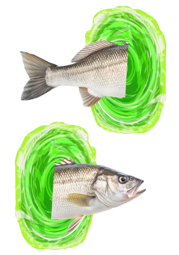

<div align="center">
  
</div>

# fish-zoxide

A port of [ohmyzsh/zoxide](https://github.com/ohmyzsh/ohmyzsh/tree/master/plugins/zoxide) for the Fish shell.

### Installation

Install with [fisher](https://github.com/jorgebucaran/fisher):

```shell
fisher install givensuman/fish-zoxide
```

### Usage

Replaces `cd` with `zoxide`, and sets up necessary initialization. To run the normal `cd` command, use `rcd`.

### Requirements

Just requires [zoxide](https://github.com/ajeetdsouza/zoxide)!

### License

[MIT](./LICENSE)
